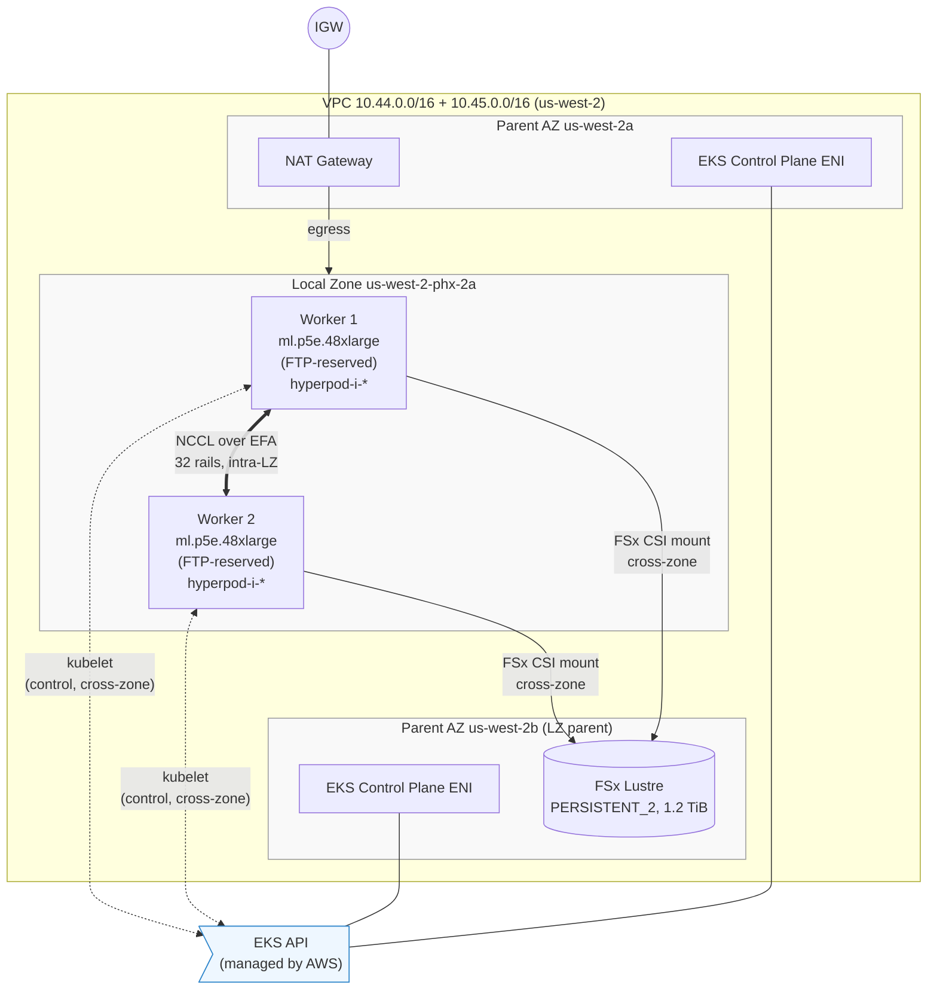

# HyperPod EKS on AWS Local Zones — Quickstart

Deploys a HyperPod cluster orchestrated by **EKS** in an AWS Local Zone. Validated end-to-end with 2× `ml.p5e.48xlarge` (H200 × 8, 32 EFA interfaces) in Phoenix Local Zone (`us-west-2-phx-2a`) via SageMaker Flexible Training Plans (FTP).

> Looking for the **Slurm variant**? See [`../slurm/`](../slurm/).

**Status:** VPC + EKS + helm dependencies + HyperPod cluster + FSx Lustre all deploy successfully. Nodes register as Kubernetes nodes with `Schedulable` health status. 2-node NCCL all-reduce hits **479 GB/s busBw at 16 GB** — matching the Slurm variant to within 1%. End-to-end DDP training with FSx-backed dataset + checkpoints validated including resume-from-checkpoint.

## Architecture



**Text summary:**

```
VPC (10.44.0.0/16 primary + 10.45.0.0/16 secondary, us-west-2)
├── us-west-2a (parent AZ 1)
│   ├── public subnet     → NAT
│   └── /28 subnet        → EKS control plane ENI
├── us-west-2b (parent AZ 2 = LZ's parent)
│   ├── public subnet     → FSx Lustre file system (cross-zone mounted from LZ)
│   └── /28 subnet        → EKS control plane ENI (HA)
└── us-west-2-phx-2a (Local Zone, secondary CIDR 10.45.0.0/24)
    └── worker subnet     → HyperPod accelerated instance group (ml.p5e.48xlarge x 2)
```

Key insight: **EKS control plane cannot create ENIs in a Local Zone**, so the control plane subnets must be in parent AZs. HyperPod's `AWS::SageMaker::Cluster.VpcConfig.Subnets` places workers in the LZ subnet. Workers join the EKS cluster via HyperPod-managed ENIs.

## Deploy workflow

Four stages, run in order:

```bash
export AWS_PROFILE=<your-profile>
export AWS_DEFAULT_REGION=us-west-2

# 1. Deploy infrastructure (~15 min: VPC, EKS, add-ons, IAM, S3, FSx Lustre in parent AZ)
./deploy-eks.sh

# 2. Install HyperPod helm dependencies + FSx CSI driver (needs helm + kubectl locally)
./install-helm.sh

# 3. Create static PV + PVC referencing the FSx file system
./create-fsx-pv.sh

# 4. Create the HyperPod cluster attached to the EKS cluster
TRAINING_PLAN_NAME=<your-ftp-name> ./create-hyperpod-cluster.sh

# 5. (Optional) Run the DDP smoke test that exercises EFA + FSx end-to-end
./run-ddp-smoke-test.sh apply
```

Why 3 stages: the AWS reference CFN uses a Lambda-based helm installer that's currently broken (urllib3 v1 vs Python 3.12 stdlib mismatch — see `.local/context.md` in the parent repo). The AWS workshop's own "Manual HyperPod Cluster Creation" path uses the local `helm` CLI, which is simpler and works reliably.

## Prereqs

- `AWS_PROFILE` with SageMaker + EKS + CFN + IAM + EC2 permissions
- Local machine: `helm >= 3`, `kubectl`, `aws` CLI, `git`, `python3`
- FTP purchased against `hyperpod-cluster` in the target LZ (2× p5e.48xlarge for this test)
- Local Zone opted in

## Files

- `hyperpod-eks-lz-stack.yaml` — CFN template. Creates VPC, subnets (parent AZ + LZ), EKS with add-ons, IAM, S3, and FSx Lustre in the parent AZ. Does NOT install helm charts or create HyperPod cluster.
- `deploy-eks.sh` — Stage 1: deploy the CFN stack.
- `install-helm.sh` — Stage 2: install HyperPod dependencies + aws-fsx-csi-driver via local helm CLI.
- `create-fsx-pv.sh` — Stage 3: create static PV + PVC referencing the CFN-managed FSx.
- `create-hyperpod-cluster.sh` — Stage 4: create the HyperPod cluster attached to EKS.
- `run-ddp-smoke-test.sh` — Optional Stage 5: end-to-end DDP smoke test.
- `manifests/ddp_train.py` — Multi-node DDP training script (used by the smoke test).
- `manifests/ddp-dataset-prep-job.yaml` — One-shot Job that seeds synthetic dataset to FSx.
- `manifests/ddp-train-job.yaml` — PyTorchJob for the DDP training run.
- `manifests/nccl-2node-efa.yaml` — Working PyTorchJob for 2-node NCCL all-reduce over EFA.
- `manifests/fsx-test-pod.yaml` — Simple pod that mounts /fsx and runs write/read timing test.
- `results/*.log` — Sample outputs from working runs.

## FSx Lustre configuration

- **Location:** parent AZ (`us-west-2b` for PHX LZ). FSx is not available in most LZs.
- **Access from LZ workers:** cross-zone mount over the VPC. In-cluster mount address is `<parent-AZ-IP>@tcp:/<mount-name>` — HyperPod workers in the LZ subnet reach it directly.
- **Access mode:** `ReadWriteMany`. Multiple pods across multiple nodes can mount concurrently.
- **Provisioning:** static (we pre-create the file system in CFN and expose it as a fixed PV). Dynamic provisioning (creating a new FSx per PVC) is also supported by the CSI driver but not the common pattern for shared-training-datasets.
- **Sample measurements** from the LZ (single-stream I/O on 1 GiB file):
  - Write: ~83 MB/s (limited by single-stream fdatasync, cross-zone latency)
  - Read: ~595 MB/s (exceeds nominal 300 MB/s throughput thanks to client-side caching)
- **Recommendation:** put training data (streamed reads) on FSx; parallel access across ranks scales far higher than the single-stream numbers. Put per-node venv/software on `/opt/dlami/nvme/` (local NVMe), not FSx — pip install on FSx is dominated by small-file metadata operations.
- `results/nccl-2node-eks-tcp.log` — Sample PyTorchJob output on 2 nodes × 8 GPUs. `~3.2 GB/s busBw` (TCP fallback, no aws-ofi-nccl in container).

## Verification after all stages

```bash
# HyperPod side
aws sagemaker list-cluster-nodes --cluster-name hp-eks-lz-cluster
# → 2 nodes, InstanceStatus.Status=Running

# Kubernetes side
kubectl get nodes --show-labels
# → 2 hyperpod-i-* nodes, label sagemaker.amazonaws.com/node-health-status=Schedulable
kubectl get pods -A | grep -E "hyperpod|health|efa|nvidia|fsx"
# → all DaemonSets 1/1 Running per node, fsx-csi-node + fsx-csi-controller running
kubectl describe node hyperpod-i-<id> | grep -E "nvidia.com/gpu|vpc.amazonaws.com/efa"
# → nvidia.com/gpu: 8, vpc.amazonaws.com/efa: 32
kubectl get pv,pvc
# → fsx-lustre-pv (1200Gi RWX Bound), fsx-lustre-pvc Bound

# Quick FSx mount test
kubectl apply -f manifests/fsx-test-pod.yaml
kubectl logs fsx-test
```

## Test results

**2-node NCCL all-reduce over EFA (16 H200 GPUs across 2 pods on 2 nodes):**

| Size | busBw (GB/s) |
|---|---|
| 1 GB | 359 |
| 4 GB | 456 |
| 8 GB | 479 |
| **16 GB** | **479** |

Matches the Slurm variant of this repo to within 1% at 8-16 GB.

Container: `763104351884.dkr.ecr.us-west-2.amazonaws.com/pytorch-training:2.6.0-gpu-py312-cu126-ubuntu22.04-ec2-v1.47` (AWS Deep Learning Container with `aws-ofi-nccl` plugin baked in).

**End-to-end DDP training with FSx-backed dataset and checkpoints:**

A ~440M-param MLP trained on 2 nodes × 8 GPUs = 16 ranks, reading the dataset from FSx and writing per-epoch checkpoints back to FSx:

- 5 epochs, 160 steps, 307 seconds
- 266 samples/sec (small model on synthetic data; the point is to exercise the plumbing, not benchmark)
- Rank 0 wrote 5 checkpoints (5.2 GB each) to `/fsx/ddp-smoke/ckpt/`
- **Resume works**: re-running the same PyTorchJob detected the checkpoint, loaded state from FSx, and exited cleanly at the epoch we left off. This proves FSx durability across pod lifecycles and cross-node shared read.

Sample manifests and logs in `results/`:
- `nccl-2node-efa.yaml` — 2-node NCCL benchmark PyTorchJob (in `manifests/`)
- `nccl-2node-eks-efa.log` — raw NCCL output including topology and per-size busBw
- `nccl-2node-eks-tcp.log` — earlier run with `nvcr.io/nvidia/pytorch:24.10-py3` for comparison. NCCL falls back to TCP-over-ENA (~3.2 GB/s at 16 GB) because that image lacks `aws-ofi-nccl`.
- `ddp-train-run1.log` — full DDP training run
- `ddp-train-run2-resume.log` — resume test showing checkpoint loaded from FSx
- `fsx-mount-test.log` — FSx cross-zone mount + basic I/O test

To run the DDP smoke test yourself:
```bash
./run-ddp-smoke-test.sh apply    # seeds dataset, applies training PyTorchJob
./run-ddp-smoke-test.sh logs     # tail master log
./run-ddp-smoke-test.sh reset    # wipe checkpoints, start fresh
```

## Storage backend benchmarks

Beyond the smoke tests above, this repo includes a **storage backend benchmark
suite** that compares FSx Lustre (parent AZ + LZ) vs. S3 Mountpoint
(single-NIC + multi-NIC) across two datasets with different access patterns
(large-shard sequential vs. small-file-per-sample). See
[`benchmarks/benchmark.md`](benchmarks/benchmark.md) for the experimental
setup, methodology, and results.

## Key pod-spec requirements for EFA on HyperPod EKS

The generic `nvidia/pytorch` container will NOT get EFA performance. Three things must be right:

1. **Container image** must include `aws-ofi-nccl`. AWS Deep Learning Containers (`763104351884.dkr.ecr.<region>.amazonaws.com/pytorch-training:...-ec2`) do. Vanilla `nvcr.io/nvidia/pytorch` does not.
2. **Pod networking must be `hostNetwork: true`** with `dnsPolicy: ClusterFirstWithHostNet`. Otherwise NCCL's OOB bootstrap advertises `127.0.0.1` and cross-node ranks can't connect back to rank 0.
3. **`/dev/shm` must be > 64 MB.** Add a Memory-backed `emptyDir` volume of ~32 GiB mounted at `/dev/shm`. Otherwise NCCL fails with `No space left on device` when allocating shared memory buffers.
4. **`NCCL_SOCKET_IFNAME`** should exclude noise interfaces: `^lo,docker,veth,cni,pod-id-link,veth_def`. This forces NCCL to use the customer-VPC ENA interface for OOB bootstrap.
5. **Resource requests**: `nvidia.com/gpu: 8` and `vpc.amazonaws.com/efa: 32` so the device plugins mount the devices into the container.

See `results/nccl-efa-job.yaml` for the full working spec.

## Known gotchas

| Gotcha | Fix |
|---|---|
| EKS control plane can't be created in a Local Zone | Put EKS control-plane subnets in parent AZs; put HyperPod worker subnet in the LZ; do NOT include the LZ subnet in `AWS::EKS::Cluster.ResourcesVpcConfig.SubnetIds` |
| Reference CFN's `AvailabilityZoneId` regex rejects LZ zone IDs like `usw2-phx2-az1` | Relaxed regex: `^[a-z]{3,4}[0-9](-[a-z0-9]+)?-az[0-9]$` |
| Workshop Studio helm-install Lambda fails with urllib3 import error | Skip the Lambda entirely; use the AWS workshop's "Manual HyperPod Cluster Creation" path with local `helm` CLI |
| First helm install may hit `http2: client connection lost` mid-CRD-install | Rerun with `helm uninstall`+`kubectl delete secret sh.helm.release.v1.hyperpod-dependencies.v1`+`helm install` |
| GuardDuty auto-creates a security group in the VPC that CFN can't delete | Manually `aws ec2 delete-security-group --group-id <GuardDutyManagedSecurityGroup-*>` before stack delete |
| CFN VPC delete blocked by EKS-installed VPC endpoints leaving orphan ENIs | Manually delete VPC endpoints, wait ~60s for ENIs to release, retry stack delete |
| NCCL on EKS falls back to TCP with a generic pytorch image | Use an AWS DLC image with `aws-ofi-nccl` baked in |
| NCCL bootstrap tries `127.0.0.1` in pod network | Set `hostNetwork: true` + `dnsPolicy: ClusterFirstWithHostNet` in the pod spec |
| NCCL `No space left on device` in `/dev/shm` | Mount a Memory-backed emptyDir (~32 GiB) at `/dev/shm` |

## Teardown

```bash
aws sagemaker delete-cluster --cluster-name hp-eks-lz-cluster
aws sagemaker wait cluster-deleted --cluster-name hp-eks-lz-cluster
./deploy-eks.sh delete
```

If stack delete fails on VPC dependencies, run through the gotchas above (GuardDuty SG, VPC endpoints).
